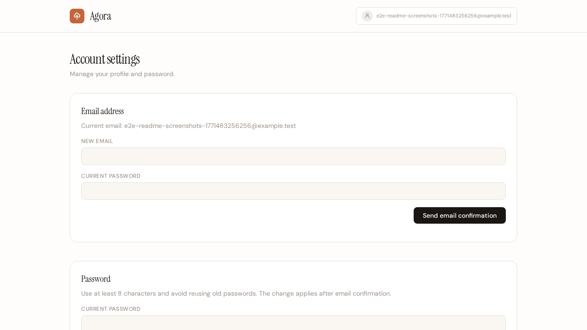
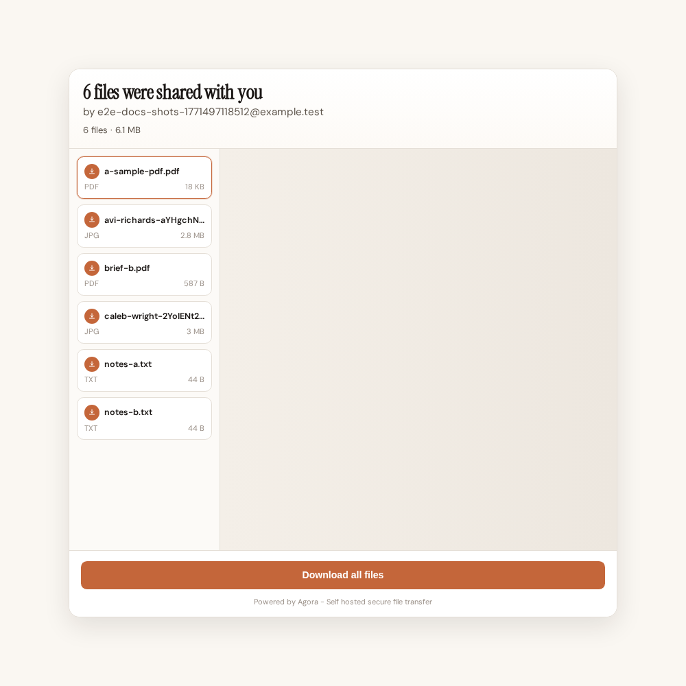

# Agora

Agora is an ASP.NET Core 10 file sharing service. Upload one or more files, generate a ZIP archive on disk, and share a URL for recipients to access a branded download page, preview files (optional), and download the archive. Shares can optionally require a download password and keep the ZIP encrypted at rest.

## Screenshots

| New Share | Download Page | Download Page Editor |
| --- | --- | --- |
| [](docs/screenshots/new-share-page.png) | [](docs/screenshots/download-page.png) | [](docs/screenshots/landing-page-editor.png) |

| Password Option | Account Password Settings | Gallery Option |
| --- | --- | --- |
| [](docs/screenshots/new-share-password-option.png) | [](docs/screenshots/account-password-settings.png) | [](docs/screenshots/new-share-gallery-option.png) |

## Quick Start (60s)

```bash
dotnet restore Agora.slnx
dotnet build Agora.slnx
cd src/Agora.Web && npm install && npm run ts:build && npm run tailwind:build
dotnet run --project src/Agora.Web/Agora.Web.csproj --urls http://127.0.0.1:18080
```

Open `http://127.0.0.1:18080`.

## Features

### Share Flow

- Multi-file upload with ZIP archive generation
- Upload limits default to 5 GB per file and 10 GB total per share
- Upload progress UI with transferred bytes and percentage
- Quick-share uploader pre-renders all selected files as `Pending` and supports canceling in-flight uploads with immediate background cleanup
- Uploaded file list with per-file sizes and remove confirmation
- Share creation is queued in Hangfire so submit returns immediately while processing continues in the background
- Share creation progress is streamed to the browser via SignalR with live task-step updates
- Preview generation runs as one Hangfire job per file on a dedicated `previews` queue
- Uploader receives an email when queued share creation is complete
- Share-created success screen with one-click link copy
- Previous shares support reopening the Share Ready link screen
- Previous shares Details modal lists archived filenames and sizes
- New share checkbox/select options persist per draft when opening the custom download page designer
- Share links default to unique 8-character alphanumeric tokens and can be customized (letters, numbers, `-`, `_`)
- Expiry options: date-based or indefinite
- Download notifications (`none`, `once`, `every_time`)

### Previews and Recipient Experience

- Share URL with download page before download
- Optional `Show previews` mode auto-adapts recipient view: image mosaic for image-only uploads, and file-by-file preview for mixed uploads
- Image lightbox on share pages with keyboard navigation, per-file download, and prev/next browsing
- PDF files render a first-page image preview automatically
- Share links include auto-generated OG images (1200x630) for social media and messaging previews
- Download page designer supports configurable download card position (corners, edges, centered)
- Per-share template background uploads are isolated from share file staging so they never appear as preview/download items
- Pending previews return a temporary placeholder image and retry-friendly UI behavior

### Security and Compliance

- Optional per-share download password with encrypted-at-rest ZIP storage
- Share links are identified directly by unique `ShareToken` values
- CSRF protection on unsafe HTTP methods (forms, fetch, and XHR)
- Built-in rate limiting for auth, authenticated user traffic, and share downloads
- Login brute-force protection with temporary account lockout after repeated failures
- Signed-in downloads are excluded from download totals

### Account and Admin

- Account settings include email and password update forms
- Registration requires email confirmation before first login
- Unconfirmed login attempts redirect to a dedicated email confirmation page
- Email and password changes require confirmation before they take effect
- Forgot password and password reset flows are supported
- Share defaults have a dedicated settings page
- New accounts default download page subtitle is set to `by <account email>`

### Operations and Reliability

- Download notifications are sent only for explicit download submissions, not share-page visits
- Download event metadata: IP, user-agent, timestamp
- Notification emails attempt IP geolocation (`City, Country`) via free `ipwho.is`; if lookup fails, the raw IP is shown
- Email templates include dark-mode-aware styling for clients that support `prefers-color-scheme`
- Resend-compatible email integration with configurable API base URL
- Auth emails are queued and sent asynchronously via Hangfire
- Daily rolling Serilog file logs with 30-day retention
- Applies pending EF Core migrations automatically on app startup

## Project Layout

- `src/Agora.Web` - endpoints, Razor Pages, startup wiring, hosted services
- `src/Agora.Application` - contracts, models, utilities
- `src/Agora.Infrastructure` - EF Core persistence and service implementations
- `src/Agora.Domain` - domain entities
- `tests/Agora.Application.Tests` - unit tests
- `tests/e2e` - Playwright end-to-end tests

## Maintainability Architecture

Recent refactors introduced explicit extension points for safer feature growth:

- Public share HTTP surface is grouped under `src/Agora.Web/Endpoints/PublicShareEndpoints.cs`
- Authenticated UI pages are served from Razor Pages under `src/Agora.Web/Pages` (legacy `/_legacy/*` HTML endpoints were removed)
- Runtime schema compatibility upgrades are isolated in `src/Agora.Web/Startup/SchemaUpgradeRunner.cs`
- Share content storage/path safety is centralized behind `IShareContentStore` (`src/Agora.Application/Abstractions/IShareContentStore.cs`, `src/Agora.Infrastructure/Services/ShareContentStore.cs`)
- Share recipient rendering behavior is strategy-based (`archive`/`gallery`) via `IShareExperienceRenderer` in `src/Agora.Web/Services/ShareExperienceRendering.cs`
- Share mode values are strongly typed through `ShareModes` in `src/Agora.Application/Models/ShareModes.cs`

For future additions, prefer extending these components instead of growing `Program.cs` or `ShareManager` responsibilities.

## Local Development

Requirements:

- .NET SDK 10.0+
- Node.js 20+ (for Tailwind/TypeScript asset builds)
- Docker (only if using `run-dev.sh` / SQL Server dev container)

### Manual Run

```bash
dotnet restore Agora.slnx
dotnet build Agora.slnx
dotnet test tests/Agora.Application.Tests/Agora.Application.Tests.csproj
cd src/Agora.Web
npm install
npm run ts:check
npm run ts:build
npm run tailwind:build
cd ../..
dotnet run --project src/Agora.Web/Agora.Web.csproj --urls http://127.0.0.1:18080
```

### Scripted Run (tmux + SQL Server)

```bash
./run-dev.sh
```

This starts:

- tmux session `agora-dev`
- SQL Server container `agora-dev-sql` on `localhost:18033`
- Agora app on `http://127.0.0.1:18080`

Stop everything:

```bash
./stop-dev.sh
```

Stop and delete the dev SQL container:

```bash
./stop-dev.sh --delete
```

## Frontend Assets

Frontend scripts are authored in TypeScript under `src/Agora.Web/scripts/ts` and bundled by `src/Agora.Web/scripts/build-ts.mjs` to `src/Agora.Web/wwwroot/js`.

```bash
cd src/Agora.Web
npm install
npm run ts:check
npm run ts:build
npm run tailwind:build
```

`shares-created.ts` imports Alpine (`alpinejs`) from npm and starts it in the bundled output.

## End-to-End Tests

Playwright tests run against a dedicated app instance on port `18090` with an isolated SQLite database:

```bash
cd tests/e2e
npm install
npx playwright install --with-deps chromium
npx playwright test
```

The test runner starts the app automatically. Test data is stored in `.e2e-data/`.

## ANDO Build

This repository includes `build.csando`.

Run validation pipeline (restore -> build -> test):

```bash
ando run --dind
```

`ando` runs a pre-hook at `scripts/ando-pre.csando` that removes `*.sync-conflict-*` files before command execution.

Authenticate to GHCR first:

```bash
echo "$GHCR_TOKEN" | docker login ghcr.io -u "$GHCR_USERNAME" --password-stdin
```

Run publish profile (build/test, publish artifacts, build and push multi-arch image to GHCR):

```bash
ando run -p publish --dind
```

## Runtime Configuration

### Core Settings

| Variable | Default | Notes |
| --- | --- | --- |
| `ConnectionStrings__Default` | `Data Source=/app/data/uploads/agora.db` | SQLite path inside container volume |
| `Agora__PublicBaseUrl` | request host | Set explicitly behind proxies/CDNs |
| `Serilog__WriteTo__0__Args__path` | `/app/data/logs/agora-.log` | Keep logs under `/app/data` in container |

### Upload and Retention

| Variable | Default | Notes |
| --- | --- | --- |
| `Agora__MaxFilesPerShare` | `20` | Max files accepted per share |
| `Agora__MaxFileSizeBytes` | `5368709120` (5 GB) | Per-file size limit |
| `Agora__MaxTotalUploadBytes` | `10737418240` (10 GB) | Total share size limit |
| `Agora__DownloadEventRetentionDays` | `90` | Download event retention window |
| `Agora__ZombieUploadRetentionHours` | `24` | Cleanup window for stale uploads |

### Email

| Variable | Default | Notes |
| --- | --- | --- |
| `Email__Provider` | `Resend` | Provider mode |
| `Email__Resend__ApiToken` | none | Required for real email delivery |
| `Email__Resend__FromAddress` | none | Must be verified by provider |
| `Email__Resend__FromDisplayName` | empty | Optional sender display name |
| `Email__Resend__ApiUrl` | `https://api.resend.com` | Override for compatible providers |

Rate limiting defaults (built in):

- Auth endpoints (`POST /login`, `POST /register`, `POST /login/development`): `10 requests/minute` per source IP
- Authenticated requests (global): `120 requests/minute` per authenticated account
- Download endpoint (`POST /s/{token}/download`): `20 requests/minute` per `(token, source IP)` pair

## Troubleshooting

- `ando run` prompts for DIND or fails non-interactively: use `ando run --dind`.
- UI changes not visible: rebuild assets with `npm run ts:build` and `npm run tailwind:build` in `src/Agora.Web`.
- No background jobs visible: open `/hangfire` and verify Hangfire storage/connection settings.
- Emails not delivered in local dev: check filesystem sink under `emails/`.

## Deployment

Docker, container runtime, and TrueNAS deployment documentation are in `docs/DEPLOYMENT.md`.

## Port Assignment

Agora uses reserved range `18000-18099`.
Default HTTP port: `18080`.
