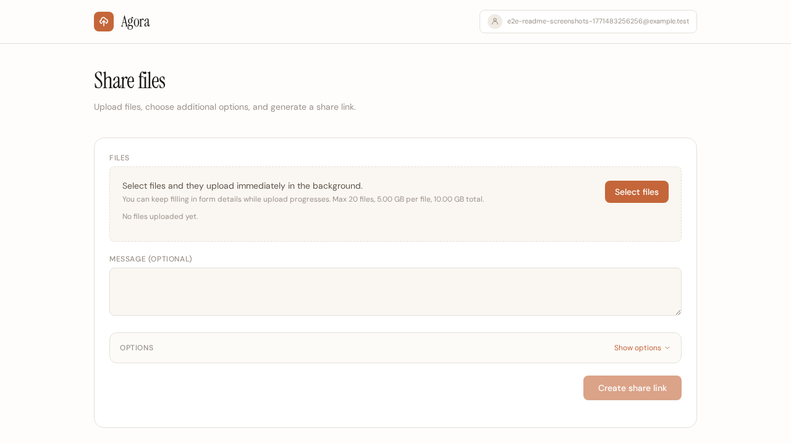
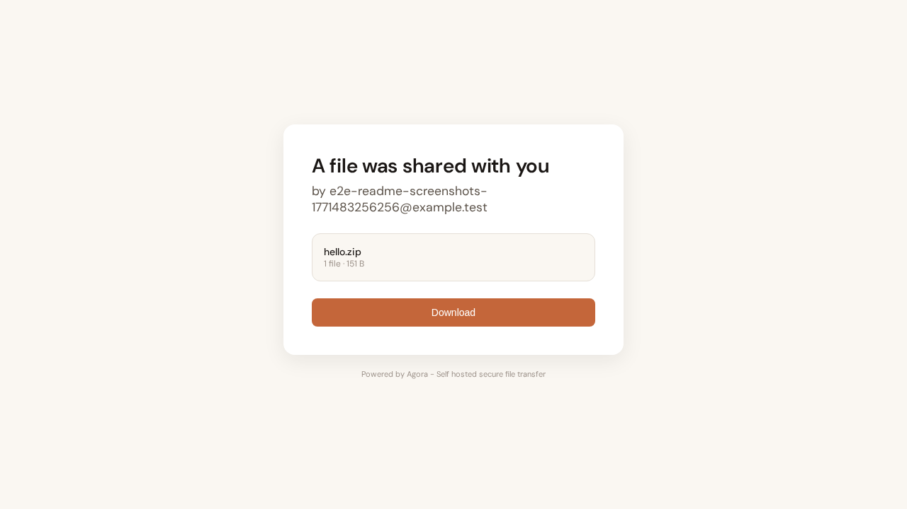
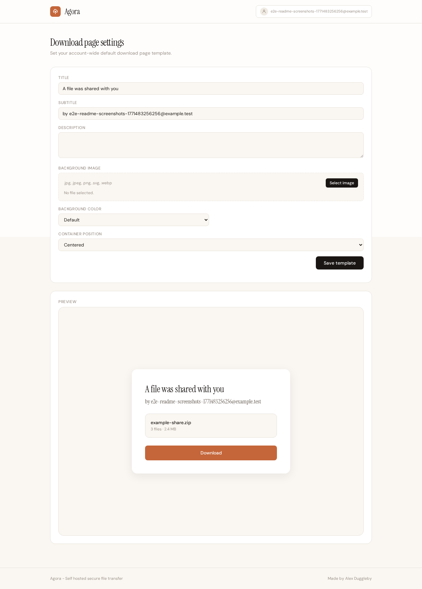
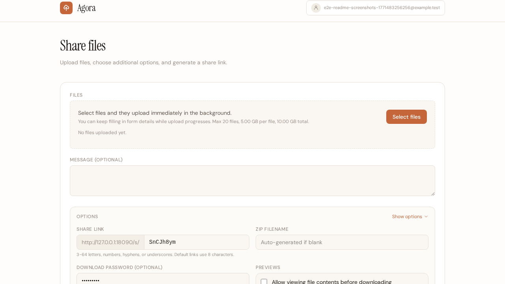
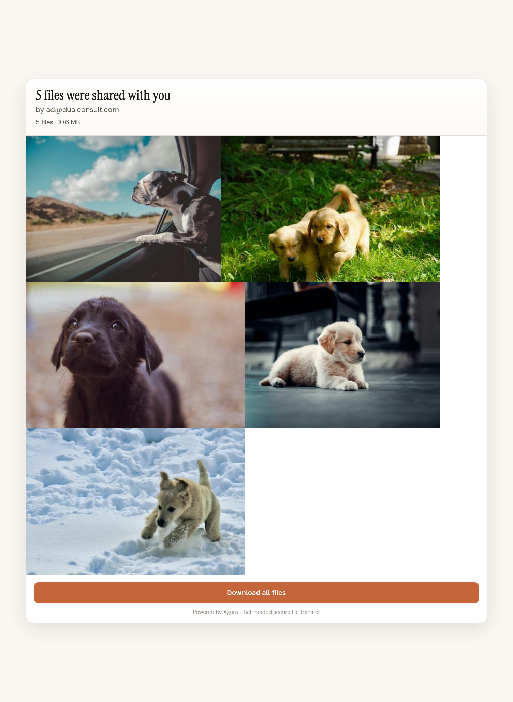
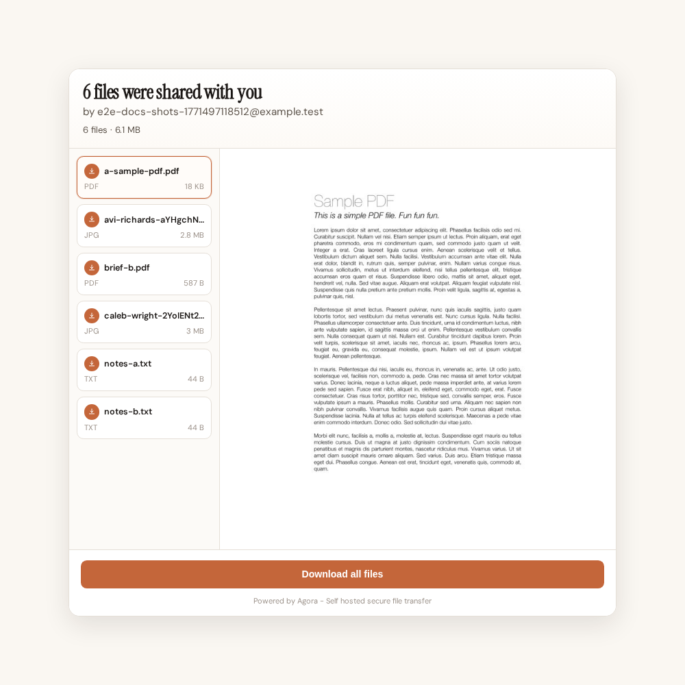

# Agora

Agora is an ASP.NET Core 10 file sharing app for sending files with branded download pages, optional previews, optional password protection, and expiry controls.

## Features

- Upload one or many files and share with one link
- Optional password prompt before download
- Optional download-page customization (title, text, background, layout)
- Optional image and file previews for recipients
- Expiring or indefinite share links
- Download notifications (`none`, `once`, `every_time`)
- Public upload links: let anyone send files to your account via a tokenized URL with a customizable 2-64 character alphanumeric code, with a dedicated success screen after submit
- Public-upload completion emails use a dedicated "files were sent to you" template and include an on-behalf-of sender identity plus the sender message
- Account display name settings for upload pages and account menu
- Share history for signed-in uploaders, with a separate "Received" section showing shares sent via public upload (sender name, email, and message)
- Email confirmation, password reset, and account security flows
- Admin controls for system defaults
- Quick-share drag-and-drop from the dashboard with cancel support and inline limit display
- Image lightbox viewer on gallery pages with keyboard navigation
- Mobile-friendly public share pages

## Screenshots

| New Share | Download Page | Download Page Editor |
| --- | --- | --- |
| [](docs/screenshots/new-share-page.png) | [](docs/screenshots/download-page.png) | [](docs/screenshots/landing-page-editor.png) |

| Password on Download | Image Gallery Mode | File Preview Mode |
| --- | --- | --- |
| [](docs/screenshots/new-share-password-option.png) | [](docs/screenshots/gallery-real-photos.png) | [](docs/screenshots/file-preview-sample-pdf.png) |

## Deployment

### Container contract

Production/container deployments should use:

- Environment variables for configuration
- One writable volume mounted at `/app/data`
- Default HTTP port `18080`

All mutable runtime data should remain under `/app/data` (uploads, database, logs).

### Docker

Build image:

```bash
docker build -t agora:latest .
```

Run container:

```bash
docker run -d \
  --name agora \
  -p 18080:18080 \
  -e ConnectionStrings__Default="Server=YOUR_SQL_HOST,1433;Database=Agora;User Id=agora;Password=YOUR_PASSWORD;TrustServerCertificate=true" \
  -e Agora__PublicBaseUrl="https://files.yourdomain.com" \
  -e Email__Provider="Resend" \
  -e Email__Resend__ApiToken="<your_token>" \
  -e Email__Resend__FromDisplayName="<display_name>" \
  -e Email__Resend__FromAddress="no-reply@yourdomain.com" \
  -e Email__Resend__ApiUrl="https://api.resend.com" \
  -e Serilog__WriteTo__0__Args__path="/app/data/logs/agora-.log" \
  -v agora_data:/app/data \
  agora:latest
```

### Create Database and User

Connect to SQL Server using your preferred client (Azure Data Studio, SSMS, `sqlcmd`, etc.):

```bash
# Example using sqlcmd
sqlcmd -S YOUR_SERVER_IP,1433 -U sa -P 'YOUR_SA_PASSWORD' -C
```

Run these SQL commands to create the Agora database and dedicated login:

```sql
-- Create database
CREATE DATABASE Agora;
GO

-- Create login with a strong password
CREATE LOGIN agora WITH PASSWORD = 'YourSecurePassword123!';
GO

-- Create user and grant permissions
USE Agora;
GO

CREATE USER agora FOR LOGIN agora;
GO

ALTER ROLE db_owner ADD MEMBER agora;
GO
```

Type `exit` to quit `sqlcmd`.

### Reverse proxy headers

If running behind Caddy/Nginx/Traefik, forward:

- `X-Forwarded-For`
- `X-Forwarded-Proto`
- `X-Forwarded-Host`

### TrueNAS SCALE (Install via YAML)

1. Create a dataset, for example `/mnt/YOUR_POOL/apps/agora/data`.
2. In `Apps -> Discover Apps`, choose `Install via YAML`.
3. Paste and adjust:

```yaml
services:
  agora:
    image: ghcr.io/aduggleby/agora:latest
    pull_policy: always
    ports:
      - "18080:18080"
    environment:
      - ConnectionStrings__Default=Server=YOUR_SQL_HOST,1433;Database=Agora;User Id=agora;Password=YOUR_PASSWORD;TrustServerCertificate=true
      - Email__Provider=Resend
      - Email__Resend__ApiToken=YOUR_RESEND_API_TOKEN
      - Email__Resend__FromDisplayName=YOUR_FROM_DISPLAY_NAME
      - Email__Resend__FromAddress=YOUR_VERIFIED_FROM_EMAIL
      - Email__Resend__ApiUrl=https://api.resend.com
      - Agora__PublicBaseUrl=https://files.YOUR_DOMAIN
    volumes:
      - /mnt/YOUR_POOL/apps/agora/data:/app/data
    restart: unless-stopped
```

## Configuration

Startup behavior:
- The app applies EF Core migrations on startup.
- If migrations fail for any reason, startup logs a fatal error and the server stops.

### Core settings

| Setting | Default | What it controls |
| --- | --- | --- |
| `ConnectionStrings__Default` | *(required)* | SQL Server connection string |
| `Agora__PublicBaseUrl` | request host | Public base URL in generated links |
| `Serilog__WriteTo__0__Args__path` | `/app/data/logs/agora-.log` | Log file path (daily rolling, 30-day retention) |

### Upload and retention

| Setting | Default | What it controls |
| --- | --- | --- |
| `Agora__MaxFilesPerShare` | `20` | Maximum files per share |
| `Agora__MaxFileSizeBytes` | `5368709120` | Per-file upload limit (5 GB) |
| `Agora__MaxTotalUploadBytes` | `10737418240` | Per-share total upload limit (10 GB) |
| `Agora__DownloadEventRetentionDays` | `90` | How long download-event records are kept |
| `Agora__ZombieUploadRetentionHours` | `24` | Cleanup window for abandoned staged uploads |

### Email

| Setting | Default | What it controls |
| --- | --- | --- |
| `Email__Provider` | `Resend` | Email provider mode |
| `Email__Resend__ApiToken` | none | API token for provider |
| `Email__Resend__FromDisplayName` | empty | Sender display name |
| `Email__Resend__FromAddress` | none | Sender address (must be verified) |
| `Email__Resend__ApiUrl` | `https://api.resend.com` | API base URL override |

## Local Development

Prerequisites:

- .NET SDK 10+
- Node.js 20+
- Docker (used by `run-dev.sh`)
- tmux (used by `run-dev.sh`)

Start local dev environment:

```bash
./run-dev.sh
```

Stop local dev environment:

```bash
./stop-dev.sh
```

## Build (ANDO)

`Agora` includes `build.csando` for pipeline-style builds.

```bash
ando run --dind
```

Learn more about ANDO: [andobuild.com](https://andobuild.com)
