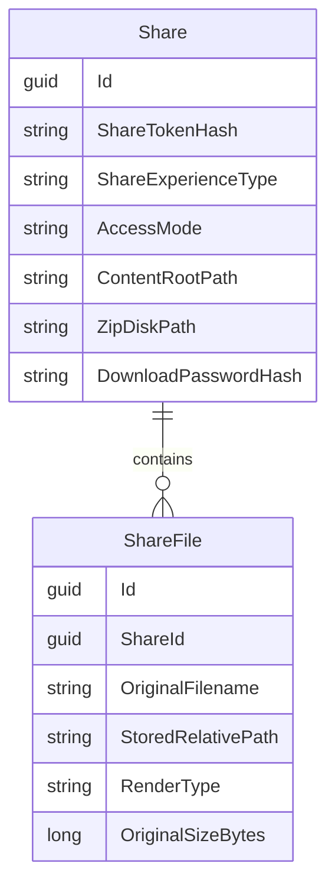

# feat: Direct-open shares, hosted pages, and galleries

## Overview
Add three high-impact self-hosted sharing capabilities to Agora:
1. Direct-open share modes (`preview-only`, `download-only`, `preview+download`) with per-file browser rendering.
2. Hosted page mode for static single-page websites (`index.html` + assets).
3. Image gallery mode with lightbox browsing and optional full-resolution download.

This keeps Agora simple for file transfer while adding modern recipient experiences usually found in hosted services.

## Why These 3 First
- They are the highest UX lift for a self-hosted deployment with no SaaS dependency.
- They directly address your target workflows: open files directly, publish one-page content, present image sets cleanly.
- They can share most of the same foundations (share mode metadata, file manifesting, safe rendering pipeline).

## Repo Context
Current implementation patterns and entry points:
- `src/Agora.Domain/Entities/Share.cs` (share metadata)
- `src/Agora.Infrastructure/Services/ShareManager.cs` (archive creation, staged upload flow)
- `src/Agora.Web/Program.cs` (HTTP endpoints and schema upgrades)
- `src/Agora.Web/Pages/S/Index.cshtml` and `src/Agora.Web/Pages/Shared/_ShareLandingCard.cshtml` (recipient page)
- `src/Agora.Infrastructure/Persistence/AgoraDbContext.cs` + migrations snapshot (EF schema)

## Technical Review Findings (Plan QA)
High:
- Hosted site mode was underspecified for same-origin risk.
  - Fix: launch with strict no-script hosted pages, aggressive CSP, and safe headers (`X-Content-Type-Options: nosniff`, `X-Frame-Options: DENY`, `Referrer-Policy: no-referrer`).
- Canonical file storage strategy was not explicitly tied to current zip-only pipeline.
  - Fix: persist original files per share under share-owned directory and treat ZIP as derivative artifact.

Medium:
- Path-based file routing (`/files/{*path}`) increases traversal/normalization complexity.
  - Fix: use ID-based file routes (`/files/{fileId}`) for previews/download; use controlled asset lookup for site mode.
- Gallery phase depended on thumbnail pipeline without rollout fallback.
  - Fix: ship gallery v1 with direct originals + lazy loading; add thumbnails as follow-up optimization.
- Unresolved rollout decisions could block implementation.
  - Fix: set default decisions now (documented below) and keep optional feature flags.

Decisions for this implementation:
- Hosted page JS: disabled at launch.
- Gallery original downloads: enabled by default.
- ZIP derivative generation: eager at upload (matching current architecture).
- Feature rollout: enabled globally first; account-level toggles can be follow-up.

## Proposed Feature Set

### 1) Direct-Open Share Modes
Add per-share access behavior:
- `download_only`: current behavior
- `preview_only`: no ZIP download, preview in browser where supported
- `preview_and_download`: both preview and ZIP download

Behavior:
- For multi-file shares, render file list with inline preview where possible.
- For single-file shares, open preview directly (if supported) and expose download action per mode.
- Keep password/expiry/rate-limit behavior consistent.

### 2) Hosted Single-Page Site Mode
Add a specialized share type for static sites:
- Detect required `index.html` at upload validation.
- Serve files from isolated share root (`/s/{token}/site/*`) with strict path normalization.
- Apply hardened headers and CSP to reduce XSS and data exfiltration risk.
- Optional download ZIP remains controlled by share mode.

### 3) Image Gallery Mode
Add gallery-first recipient experience:
- Grid, lightbox, keyboard nav, optional caption/filename.
- Responsive image variants + lazy loading.
- Optional original image download toggle per share.
- Batch download as ZIP for non-preview workflows.

## Technical Approach

### Data Model (Shared Foundation)
Add fields to `Share`:
- `ShareExperienceType` (`archive`, `site`, `gallery`)
- `AccessMode` (`download_only`, `preview_only`, `preview_and_download`)
- `ContentRootPath` (relative directory path containing canonical files for this share)

Add fields to `ShareFile`:
- `StoredRelativePath` (canonical file location under `ContentRootPath`)
- `RenderType` (`image`, `pdf`, `video`, `audio`, `text`, `binary`, `html`, `css`, `js`, etc.)

### Storage Model
- Keep canonical uploaded file set under share-owned directory (`/app/data/uploads/shares/{id}/files/...`).
- Keep ZIP generation as derivative artifact (on create or on-demand based on experience/access mode).
- For password-protected shares, encrypt ZIP derivative at rest as already implemented.
- Cleanup must remove `ContentRootPath`, ZIP derivative, and share-owned background image assets.

### Routing and Rendering
- Add recipient endpoints:
  - `GET /s/{token}/files` (manifest)
  - `GET /s/{token}/files/{fileId:guid}` (safe streamed file serving by ID)
  - `GET /s/{token}/site` and `GET /s/{token}/site/{*path}` (hosted site)
  - `GET /s/{token}/gallery` (gallery view)
- Reuse existing token lookup, expiry checks, and download event tracking.
- Extend card/UI components to branch by `ShareExperienceType`.

### Security Controls
- Strict path traversal defense (`GetFullPath` + storage root prefix check).
- Content-Type allowlist + forced download for unknown/binary types.
- For hosted sites:
  - CSP with script disabled at launch: `script-src 'none'`.
  - Restrict external fetch/form/embed capabilities (`connect-src 'none'`, `form-action 'none'`, `frame-ancestors 'none'`).
  - Disable directory listing and hidden files.
  - Resolve assets from known uploaded filenames only.
- Keep CSRF enforcement for protected POST flows.

## Implementation Phases

### Phase 1: Foundation (Schema + Canonical Storage)
What:
- Add schema fields and backward-compatible defaults.
- Persist canonical source files per share.
- Add manifest endpoint and service abstractions.

Why:
- All three features depend on explicit file metadata and experience type.

Deliverables:
- EF model/migration updates
- Share creation pipeline updates (store originals + create ZIP derivative)
- Unit tests for metadata inference and path normalization

### Phase 2: Direct-Open Modes
What:
- Add access mode selection to upload UI.
- Implement file-serving and preview rendering on recipient page.
- Keep current ZIP download flow as default behavior.

Why:
- Fastest user-visible value with minimal conceptual overhead.

Deliverables:
- Updated `/shares/new` options UI
- Recipient preview UX for supported file types
- E2E coverage for each mode

### Phase 3: Hosted Page Mode
What:
- Add `site` experience in uploader and validator.
- Serve static assets securely from share root.
- Provide clear validation errors for invalid site bundles.

Why:
- Enables lightweight publishing use cases with strong self-hosting fit.

Deliverables:
- Site validation and routing
- Security header/CSP implementation
- E2E tests for route serving and traversal prevention

### Phase 4: Gallery Mode
What:
- Add `gallery` experience and image-first rendering.
- Add lightbox, keyboard navigation, lazy loading.
- Add toggles for original downloads and zip export.

Why:
- Delivers highest presentation quality for image-heavy transfers.

Deliverables:
- Gallery UI components and endpoints
- v1 without thumbnail generation (lazy load originals)
- E2E tests for browsing and download controls

## ERD (Planned Additions)

## Acceptance Criteria
- [ ] Upload form allows selecting `archive/site/gallery` experience and access mode.
- [ ] `preview_only` shares do not expose ZIP download links.
- [ ] `preview_and_download` shares support both preview and ZIP download.
- [ ] Site mode serves `index.html` + assets correctly and blocks traversal attempts.
- [ ] Site mode runs with no script execution and hardened headers/CSP.
- [ ] Gallery mode renders image grid + lightbox and supports optional original download.
- [ ] Existing archive shares (created before schema change) continue to function unchanged.
- [ ] Password-protected download flow remains intact for ZIP derivative downloads.
- [ ] Unit + integration + e2e tests cover each experience and access mode.

## Dependencies and Risks
Dependencies:
- Additional storage for derivatives (thumbnails + optional ZIPs).
- Background processing for thumbnail generation and cleanup.

Risks:
- Hosted HTML security risk if CSP/path checks are weak.
- Increased complexity in recipient page routing and UX states.
- Performance regression for large image sets without paging/lazy loading.

Mitigations:
- Ship site mode behind a feature flag initially.
- Add strict path/ctype tests and security-focused e2e checks.
- Implement paged manifests and progressive image loading.

## Testing Strategy
- Unit tests:
  - Render type detection
  - Access mode authorization
  - Path normalization and traversal rejection
- Integration tests:
  - Share creation + metadata persistence
  - File serving headers and response behavior
- E2E tests:
  - Direct-open flows by mode
  - Hosted site routing and asset loading
  - Gallery navigation + download controls

## Documentation Updates
- `README.md`: new share experiences and access modes.
- `AGENTS.md`: operational/security notes for hosted page mode and gallery derivatives.
- `docs/plans/...`: this plan updated during execution if scope changes.

## Open Questions
1. Should hosted site mode allow custom JS at launch, or start with JS disabled by default?
2. For gallery mode, should originals be downloadable by default or opt-in?
3. Should ZIP derivatives be generated eagerly at upload or lazily on first download?
4. Do we want per-user feature toggles (`site`, `gallery`) in account settings for rollout control?

Status of open questions for this iteration:
1. Resolved: JS disabled at launch.
2. Resolved: originals downloadable by default.
3. Resolved: eager generation.
4. Deferred: per-user toggles are follow-up work.
