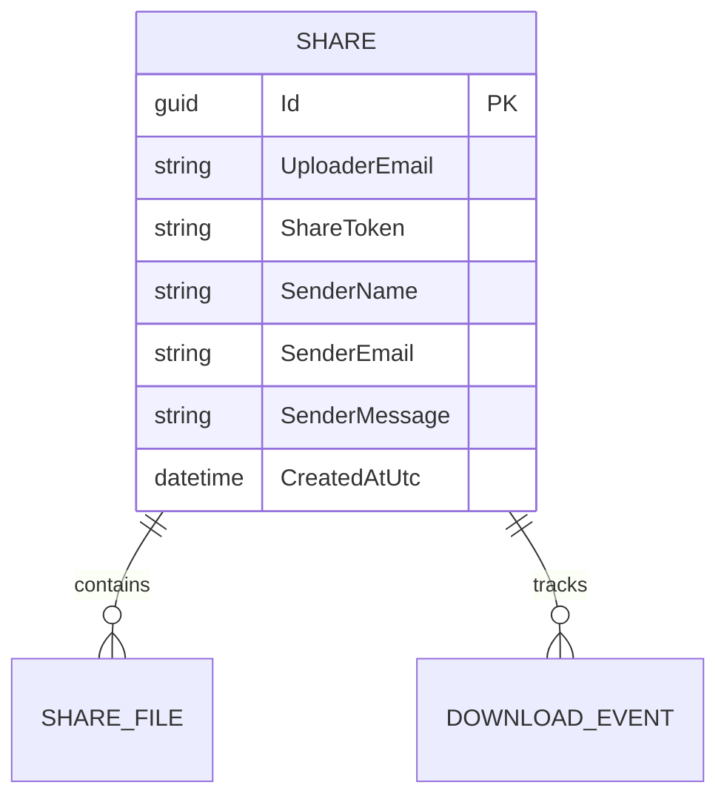

# feat: Public upload intake with share-link email

## Overview

Add a tokenized public upload flow at `/u/<token>` so external senders can submit files without signing in, provide sender name/email/message, and trigger the existing share creation pipeline. Each account user gets an individual upload link from Account Settings. When processing completes, send that user an email containing sender details and the generated share link.

## Problem Statement / Motivation

Current upload/share flows are authenticated (`/shares/new`) and assume the uploader is a signed-in account owner. That blocks user-specific public intake URLs for external people.

Required behavior:
- Public route at `/u/<token>`
- Each account user has an individual upload token/link in Account Settings
- Sender fields: name, email, message
- File uploader (same limits as existing flow)
- Create a share link after processing
- Email target user with sender info + share link when ready

## Research Summary (Local)

### Relevant Existing Patterns

- Share creation already runs asynchronously and emails uploader when ready: `src/Agora.Web/Services/QueuedShareCreationJob.cs:53`
- Upload staging and limit enforcement already exist (max files, per-file, total): `src/Agora.Web/Program.cs:916`, `src/Agora.Web/Program.cs:1122`
- Existing share form and uploader UI are reusable: `src/Agora.Web/Pages/Shares/New.cshtml:20`
- Frontend upload flows already modularize limits and staged upload behavior:
  - `src/Agora.Web/scripts/ts/upload-limits.ts`
  - `src/Agora.Web/scripts/ts/shares-new.ts:1`
  - `src/Agora.Web/scripts/ts/quick-share-dropzone.ts:1`
- Share ownership currently keys off `UploaderEmail` and authenticated user claims: `src/Agora.Web/Pages/Shares/Created.cshtml.cs:37`

### Institutional Learnings

- No entries currently found in `docs/solutions/` relevant to this feature.

## Research Decision

Proceeding without external research.

Reasoning:
- No new framework or third-party integration is required.
- The codebase already has mature staging, queueing, email, and share-generation patterns to reuse.
- Main work is adapting auth/ownership boundaries for a public intake route.

## Proposed Solution

Implement a dedicated public intake flow that reuses the existing staged-upload + queued share creation pipeline, while preserving ownership and security constraints.

### Key Design Choices

- Keep `/u/<token>` anonymous and separate from `/shares/new` (authenticated).
- Reuse current size/count limits from `AgoraOptions` unchanged.
- Reuse current queued share creation job and share storage pipeline.
- Store sender metadata explicitly (name/email/message) on share so email and dashboard can reference it safely.
- Resolve destination account user by upload token, then set share ownership to that user email.

### Data Model Changes

Add sender metadata fields to `Share` (additive):
- `SenderName` (nullable)
- `SenderEmail` (nullable)
- `SenderMessage` (nullable)

Add per-user upload token support:
- `UserAccount.UploadToken` (non-null, unique)
- Optional `UserAccount.UploadTokenUpdatedAtUtc` (for audit/regeneration tracking)

Update:
- `src/Agora.Domain/Entities/Share.cs`
- `src/Agora.Domain/Entities/UserAccount.cs`
- `src/Agora.Infrastructure/Persistence/AgoraDbContext.cs`
- New EF migration under `src/Agora.Infrastructure/Persistence/Migrations/`

### Routing and Flow

1. GET `/u/{token}`
- Render form with sender fields at top and file uploader below.
- Resolve target user by `token`; reject unknown token.
- Include hidden draft/intake identifiers similar to current staged upload flow.

2. POST `/api/public-uploads/stage`
- Anonymous staging endpoint for `/u/{token}` flow only.
- Enforce existing upload limits.
- Scope staged files to a signed intake session token that also binds the target user id/email.

3. POST `/api/public-uploads/create-share`
- Validate sender fields and staged upload ownership.
- Build `QueuedShareCreationJob.Payload` with resolved target user email + sender metadata.
- Queue share creation and redirect to a public status page (`/u/{token}/created?share=...`) or show inline pending state.

4. Queued job completion email
- Send target user email containing:
  - Sender name/email
  - Sender message
  - Share link

5. Account Settings
- Show each signed-in user their intake URL: `/u/<uploadToken>`.
- Add regenerate action for upload token (invalidates old link).

## SpecFlow Analysis

### User Flow Overview

1. External sender opens `/u/<token>` and sees sender identity section + uploader.
2. Sender uploads one or more files (staged async).
3. Sender submits form; system queues share generation.
4. System validates staged files/limits, creates share for the token owner, and emails that user with link + sender context.
5. Recipient opens link via existing `/s/{token}` experience.

### Flow Permutations Matrix

| Flow | Variant | Expected behavior |
|---|---|---|
| Upload start | Valid intake token | New draft/intake session created and bound to token owner |
| Upload start | Invalid/revoked intake token | 404/invalid link page with no upload capability |
| Upload start | Returning sender with stale tab | New session or clear invalid staged IDs gracefully |
| Stage upload | File too large / too many files / total too large | Immediate validation error using existing limit messages |
| Submit | No files staged | Block submit with clear reason |
| Submit | Invalid sender email | Block submit and preserve entered fields |
| Queue processing | Email send fails | Share still created; log warning; show non-fatal status |
| Abuse case | High-frequency anonymous posts | Rate-limit/throttle response; no share creation |

### Missing Elements & Gaps

- **Category**: Token lifecycle and ownership
- **Gap Description**: Upload token generation, rotation, and revocation behavior is unspecified.
- **Impact**: Old leaked links may remain active or route files incorrectly.
- **Current Ambiguity**: Rotate-on-demand only vs periodic rotation vs immediate invalidation model.

- **Category**: Abuse prevention
- **Gap Description**: Anonymous upload rate limits and bot protections are not defined.
- **Impact**: Storage abuse, queue flood, email spam.
- **Current Ambiguity**: IP throttling, captcha, and max daily submissions unknown.

- **Category**: Sender metadata persistence
- **Gap Description**: Where sender fields live is unspecified.
- **Impact**: Cannot reliably include sender data in emails/dashboard/history.
- **Current Ambiguity**: Reuse `UploaderMessage` vs dedicated sender columns.

- **Category**: UX completion state
- **Gap Description**: Sender-facing post-submit page behavior not defined.
- **Impact**: Confusing “did it work?” experience.
- **Current Ambiguity**: Redirect to created page vs inline status.

### Critical Questions Requiring Clarification

1. Critical: Should upload tokens be permanent until manually regenerated, or automatically rotated on a schedule?
- Why it matters: affects link stability vs security posture.
- Default assumption if unanswered: manual regeneration only from Account Settings.

2. Critical: What anti-abuse level is required for anonymous uploads (IP rate limit only vs captcha + rate limit)?
- Why it matters: protects storage, queue, and email channel.
- Default assumption if unanswered: add conservative IP throttling for stage/create endpoints.

3. Important: Should sender metadata appear only in email, or also in dashboard share history/details?
- Why it matters: affects schema and UI scope.
- Default assumption if unanswered: persist metadata and expose in share details.

4. Important: Should sender receive any confirmation email?
- Why it matters: UX and abuse surface area.
- Default assumption if unanswered: no sender email in v1.

## Technical Considerations

- Preserve existing `ShareToken` plaintext behavior and index semantics.
- Keep staged upload path-traversal and ownership checks equivalent to current flow.
- Keep async queue flow idempotent and resilient (email failures non-fatal).
- Keep all persisted timestamps in UTC.
- Preserve container data contract under `/app/data`.

## Implementation Plan

### Phase 1: Public intake foundation

- [x] Add tokenized public intake Razor page and page model:
  - `src/Agora.Web/Pages/U/Index.cshtml`
  - `src/Agora.Web/Pages/U/Index.cshtml.cs`
- [x] Reuse uploader component structure from `src/Agora.Web/Pages/Shares/New.cshtml` with sender section above uploader.
- [x] Add anonymous intake staging/create endpoints in `src/Agora.Web/Program.cs`.
- [x] Add anti-forgery + request validation for new public POST endpoints.
- [x] Add token lookup guards and invalid/revoked token responses.

### Phase 2: Data and queue integration

- [x] Add sender fields to `Share` entity and EF mapping:
  - `src/Agora.Domain/Entities/Share.cs`
  - `src/Agora.Infrastructure/Persistence/AgoraDbContext.cs`
- [x] Add upload token fields/index to user entity and mapping:
  - `src/Agora.Domain/Entities/UserAccount.cs`
  - `src/Agora.Infrastructure/Persistence/AgoraDbContext.cs`
- [x] Add migration for sender fields.
- [x] Extend queue payload and share creation mapping:
  - `src/Agora.Web/Services/QueuedShareCreationJob.cs`
  - `src/Agora.Application/Models/CreateShareCommand.cs`
  - `src/Agora.Infrastructure/Services/ShareManager.cs`

### Phase 3: Recipient email + UI completion

- [x] Update ready-link email content in queued job to include sender metadata.
- [x] Add sender-facing completion/status page or pending state.
- [x] Ensure disabled buttons include tooltip text explaining why disabled.
- [x] Add Account Settings UI to display and regenerate `/u/<token>` link.

### Phase 4: Frontend behavior and build outputs

- [x] Add upload page TS module under `src/Agora.Web/scripts/ts/` reusing limit helpers.
- [x] Generate corresponding `wwwroot/js` outputs.
- [x] Run Tailwind build if HTML/class changes require CSS regeneration.

## Acceptance Criteria

- [x] Visiting `/u/<token>` with a valid token anonymously shows sender name/email/message fields and uploader below.
- [x] Visiting `/u/<token>` with invalid/revoked token shows non-upload error state.
- [x] Upload limits match `/shares/new` (max files, max file size, max total size).
- [x] Sender can submit staged files without authentication.
- [x] Submission queues share creation and produces a valid `/s/{token}` share.
- [x] Token owner receives email when ready containing sender name, sender email, sender message, and share link.
- [x] Existing authenticated `/shares/new` behavior remains unchanged.
- [x] Anonymous abuse controls are applied to public upload endpoints.
- [x] Added/updated tests cover happy path + core validation failures.
- [x] Account Settings shows each user’s upload link and supports token regeneration.

## Testing Plan

- [x] Backend build: `dotnet build Agora.slnx`
- [x] Unit tests (targeted + existing): `dotnet test tests/Agora.Application.Tests/Agora.Application.Tests.csproj`
- [ ] E2E additions in `tests/e2e/specs/`:
  - [x] public `/u/<token>` happy path to recipient email artifact
  - [x] invalid `/u/<token>` behavior
  - [x] invalid sender email
  - [x] limit exceed cases
  - [x] unauthenticated stage/create lifecycle
  - [x] token regeneration invalidates previous link
- [x] If TypeScript changes, rebuild generated JS artifacts.

## Risks & Mitigations

- Risk: Anonymous endpoint abuse (storage/email spam)
- Mitigation: Endpoint throttling, strict limit checks, optional captcha follow-up.

- Risk: Incorrect ownership mapping for created shares
- Mitigation: Resolve owner strictly by upload token and add tests for token-to-user mapping.

- Risk: Regressing authenticated share flow
- Mitigation: Keep new endpoints isolated; reuse existing internals via additive paths only.

## Success Metrics

- `/u/<token>` conversion: successful submissions / started submissions
- Queue success rate for upload-intake shares
- Recipient ready-email delivery success rate
- Abuse rejection rate (throttle/validation) without impacting legitimate submissions

## ERD (if sender fields are added to `Share`)

## References

- Existing upload stage + create endpoints: `src/Agora.Web/Program.cs:916`, `src/Agora.Web/Program.cs:1122`
- Existing share UI: `src/Agora.Web/Pages/Shares/New.cshtml:20`
- Existing queued share creation and ready-link email: `src/Agora.Web/Services/QueuedShareCreationJob.cs:53`
- Existing share ownership checks: `src/Agora.Web/Pages/Shares/Created.cshtml.cs:37`
- Existing share schema and token index: `src/Agora.Infrastructure/Persistence/AgoraDbContext.cs:20`
